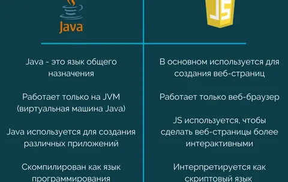

# Java Script 
 ### JavaScript – это мультипарадигменный язык программирования, который обычно применяется в качестве встраиваемого инструмента для программного доступа к различным объектам приложений. С точки зрения веб-разработки, без знаний этой технологии невозможно заниматься созданием современных интерактивных сайтов.
# _Privitive_
### Примитивные типы данных Java — это основа, на которой держится всё. Нет, я нисколько не преувеличиваю. У Oracle примитивам посвящён отдельный Tutorial: Primitive Data Types

 # _Varible_

* LET- Local
* Var - Global
* Const - Local
 
# Так надо подключить JS в HTML
###  Чтобы встроить JavaScript в HTML, открываем файл HTML в любом текстовом редакторе, добавляем теги , между ними пишем код программы. 

# Операторы — это символы языка, выполняющие различные операции с данными. Операторы могут записываться с помощью символов пунктуации или ключевых слов.

# HISTORY
### В 1992 году компания Nombas (впоследствии приобретённая Openwave)
Hачала разработку встраиваемого скриптового языка Cmm (Си-минус-минус), который, по замыслу разработчиков, должен был стать достаточно мощным, чтобы заменить макросы, сохраняя при этом схожесть с Си, чтобы разработчикам не составляло труда изучить его. Главным отличием от Си
была работа с памятью. В новом языке всё управление памятью осуществлялось автоматически: не было необходимости создавать буфера, объявлять переменные, осуществлять преобразование типов. В остальном языки сильно походили друг на друга: в частности, Cmm поддерживал стандартные функции и операторы Си.Cmm был переименован.
 # Особенности Java Script
 ### JavaScript — это язык программирования, который в первую очередь применяют в вебе. С его помощью сайты делают интерактивными: добавляют всплывающие окна, анимацию, кнопки лайков и формы для отправки информации. Его ещё называют главным языком фронтенда — «лицевой» стороны сайта, с которой взаимодействуют пользователи.
 # Основные различия Java и JavaScript
 
  # Thank You

 
